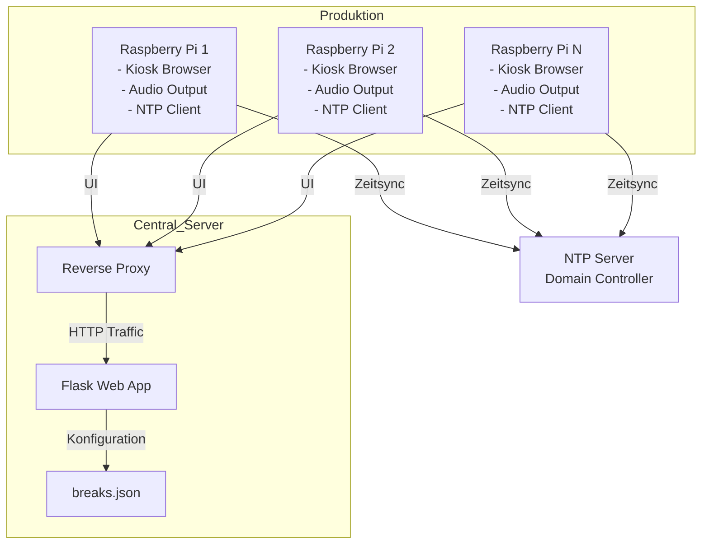

# Projektplan: Digitale Produktionsuhr mit Pausenanzeige (Revision)

## Systemübersicht
- **Web-App**: 
  - Backend: Python/Flask mit RESTful APIs
  - Frontend: Single-Page Application (HTML/CSS/JS)
- **Hardware**:
  - Raspberry Pis mit HDMI-Displays und Lautsprechern
  - Zentraler Server (VM oder physischer Server)
- **Zeitsynchronisation**: 
  - Domain Controller als primärer NTP-Server
  - Fallback zu öffentlichen NTP-Servern
- **Pausenplan**:
  - Zentral verwaltete JSON-Konfiguration
  - Änderungen ohne Neustart der Anwendung

## Architekturdiagramm


## Komponentenbeschreibungen

### Backend-Komponenten
1. **Flask Application**
   - REST API für Konfigurationsverwaltung
   - Statische Dateiauslieferung für Frontend
   - Endpoints:
     - `/` → Frontend-SPA
     - `/api/config` → Pausenkonfiguration (GET)
     - `/api/health` → Systemstatus

2. **Konfigurationsdatei (`breaks.json`)**
   - Struktur:
   ```json
   {
     "version": "1.0",
     "breaks": [
       { "id": 1, "start": "10:00", "end": "10:15", "description": "Vormittagspause" },
       { "id": 2, "start": "12:00", "end": "12:30", "description": "Mittagspause" },
       { "id": 3, "start": "15:00", "end": "15:15", "description": "Nachmittagspause" }
     ]
   }
   ```

### Frontend-Komponenten
1. **Uhr-Anzeige**
   - Große digitale Uhr (HH:MM:SS)
   - Automatische Aktualisierung (1s Intervall)
   - Responsive Design für verschiedene Displaygrößen

2. **Pausen-Manager**
   - Erkennung aktiver Pausenzeiträume
   - Fortschrittsbalken für laufende Pausen
   - Akustische Signale bei Pausenbeginn/-ende

3. **Statusanzeige**
   - Verbindungsstatus zum Server
   - NTP-Synchronisationsstatus
   - Letzte Aktualisierung

### Raspberry Pi-Komponenten
- **Browser-Konfiguration**:
  - Chromium im Kiosk-Modus
  - Autostart der Web-App
- **Audio-System**:
  - Lautstärkeregelung
  - Tonausgabe über HDMI oder 3.5mm Jack
- **Zeitsynchronisation**:
  - NTP-Client-Konfiguration
  - Manueller Sync-Button im Notfall

## Umsetzungsschritte

| Phase | Aufgabe | Verantwortlich | Dauer | Abhängigkeiten |
|-------|---------|----------------|-------|----------------|
| 1. Setup | Server-Infrastruktur einrichten | SysAdmin | 2 Tage | - |
| 2. Backend | Flask-App entwickeln | Backend-Dev | 3 Tage | Phase 1 |
| 3. Frontend | UI-Komponenten implementieren | Frontend-Dev | 4 Tage | Phase 2 |
| 4. Konfiguration | Pausenmanagement-System | DevOps | 1 Tag | Phase 2 |
| 5. Hardware | Raspberry Pi Setup | HW-Team | 3 Tage | - |
| 6. Integration | Gesamtsystemintegration | Team | 2 Tage | Phase 3,4,5 |
| 7. Testing | Systemtests durchführen | QA | 3 Tage | Phase 6 |
| 8. Deployment | Produktivsetzung | DevOps | 1 Tag | Phase 7 |

## Teststrategie
- **Komponententests**: Unit Tests für Backend-Logik
- **Integrationstests**: API-Endpunkt-Verifizierung
- **Systemtests**: 
  - Pausenerkennung unter verschiedenen Zeitszenarien
  - Audio-/Videoausgabe auf Raspberry Pis
  - Netzwerkausfall-Simulation
- **Akzeptanztests**: Benutzerabnahme mit Produktionspersonal

## Risikoanalyse
| Risiko | Wahrscheinlichkeit | Auswirkung | Gegenmaßnahme |
|--------|---------------------|------------|---------------|
| NTP-Sync-Fehler | Mittel | Hoch | Fallback-NTP-Server konfigurieren |
| Netzwerkausfall | Niedrig | Hoch | Lokale Zeitberechnung im Notfallmodus |
| Browser-Absturz | Niedrig | Mittel | Automatischer Neustart des Browsers |
| Konfigurationsfehler | Mittel | Mittel | Validierung beim Speichern der breaks.json |

## Deployment
1. Server-Bereitstellung:
   - Flask-App in Docker-Container
   - Nginx als Reverse Proxy
   - Automatisierte Bereitstellung via Ansible

2. Raspberry Pi Setup:
   ```bash
   # Kiosk-Modus einrichten
   sudo apt install chromium-browser
   sudo nano /etc/xdg/lxsession/LXDE-pi/autostart
   # Hinzufügen: @chromium-browser --kiosk --incognito http://server-ip
   ```

3. Wartung:
   - Remote-Update-Mechanismus für Frontend
   - Log-Überwachung
   - Regelmäßige NTP-Überprüfung

## Timeline
```mermaid
gantt
    title Projektzeitplan
    dateFormat  YYYY-MM-DD
    section Vorbereitung
    Infrastruktur       :a1, 2025-06-03, 2d
    section Entwicklung
    Backend             :a2, after a1, 3d
    Frontend            :a3, after a1, 4d
    Raspberry Setup     :a4, 2025-06-03, 3d
    section Integration
    Systemintegration   :a5, after a2 a3 a4, 2d
    Testing             :a6, after a5, 3d
    Deployment          :a7, after a6, 1d